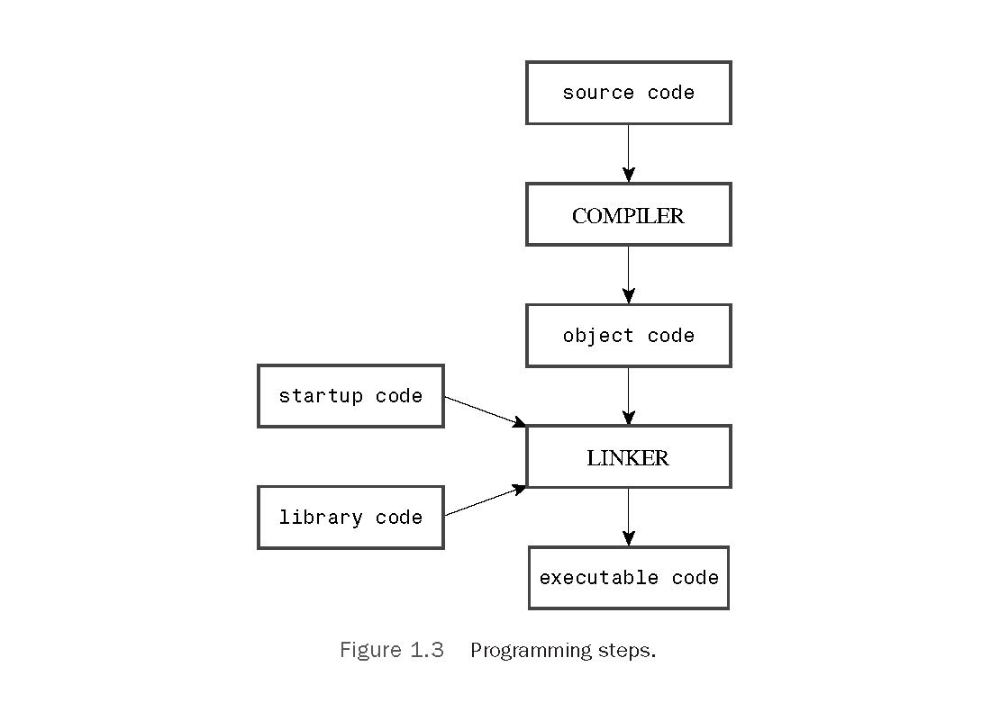

## Getting Started with C++

* `C++` 是 `C` 语言的超集，这意味着**任何有效的 `C` 程序都是有效的 `C++` 程序**。
* 与**强调算法的过程性编程**不同的是，**`OOP` 强调的是数据**。`OOP` 的理念是设计与问题的本质特性相对应的数据格式。
* `C++` 真正的优点之一是：可以方便地重用和修改现有的、经过仔细测试的代码。
* 调试版包含额外的代码，这会增大程序、降低执行速度，但可提供详细的调试信息。
* Programming steps of `C++`：  

