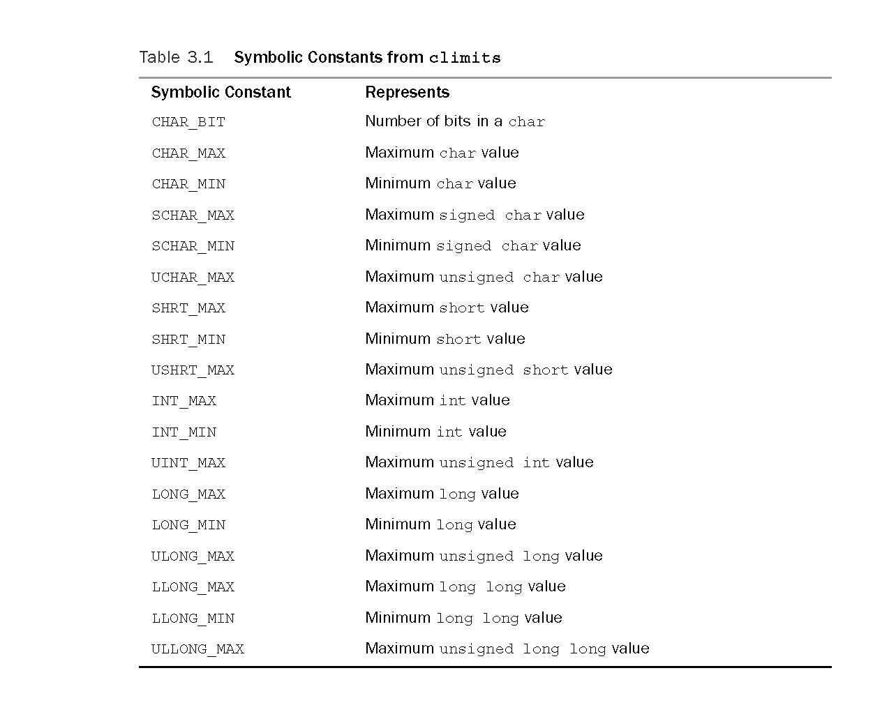

# \#include &lt;climits&gt;

* 头文件 `climits` 中包含了关于整型限制的信息。



```cpp
#include <iostream>
#include <climits>
using namespace std;

int main() {
	cout << sizeof(short) << " " << sizeof(int) << " " << sizeof(long) << " " << sizeof(long long) << endl;	// 2 4 4 8
	cout << SHRT_MIN << " " << INT_MIN << " " << LONG_MIN << " " << LLONG_MIN << endl;	// -32768 -2147483648 -2147483648 -9223372036854775808
	cout << SHRT_MAX << " " << INT_MAX << " " << LONG_MAX << " " << LLONG_MAX << endl;	// 32767 2147483647 2147483647 9223372036854775807
	return 0;
}
```

