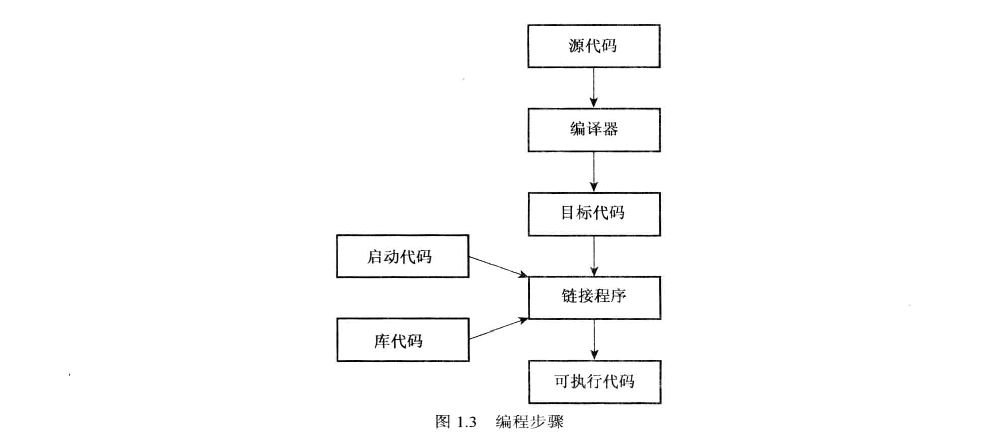

# C++

## 预备知识

* `C++` 是 `C` 语言的超集，这意味着**任何有效的 `C` 程序都是有效的 `C++` 程序**。
* 与**强调算法的过程性编程**不同的是，**`OOP` 强调的是数据**。`OOP` 的理念是设计与问题的本质特性相对应的数据格式。
* `C++` 真正的优点之一是：可以方便地重用和修改现有的、经过仔细测试的代码。
* 调试版包含额外的代码，这会增大程序、降低执行速度，但可提供详细的调试信息。
* 改正错误时，应首先改正第一个错误。如果在标识为有错误的那一行上找不到错误，请查看前一行。
* `C++` 的编译步骤：  

## 专业术语中英文对照表

| 中文 | English |
| :---: | :---: |
| 过程性语言 | procedural language |
| 结构化编程 | structured programming |
| 自顶向下 | top-down |
| 自下向上 | bottom-up |
| 泛型编程 | generic programming |
| 美国国家标准局 | American National Standards Institute，ANSI |
| 国际电工技术委员会 | International Electrotechnical Committee，IEC |
| 集成开发环境 | integrated development environments，IDE |

